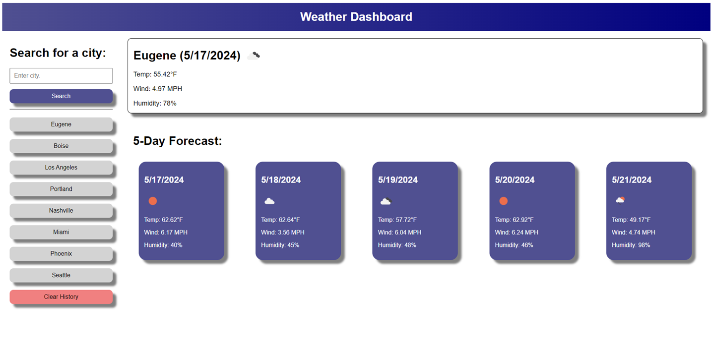

# Weather Dashboard

## Description

### User Story

This is a simple weather application.  When the user searches a city name, the weather and 5-day midday forecast is displayed on the page.  Furthermore, a button is created for that city which the user can click to more conveniently see that city's weather.

### Student Experience

This challenge was a lot of fun!  I truly enjoy taking raw data and organizing it to display it in a way that can better be understood.  I can certainly see how the use of third-party API data can be useful.  The application of this process has limitless possibilities.  I look forward to learning more about different API's in our upcoming first project!

## Installation

N/A

## Usage

Anyone with the link (https://orian42.github.io/weather/) can use this application.

The application can be used simply by entering a city in the search input box then clicking the search button.  The weather data will be displayed to the screen.  A history button labeled with the most recent search's city will be created and placed below the search button.  A user can simply click that new button to see that city's weather.  Note that if the user manually searches for a city that already has a button displayed, a new button for that city WIL NOT be created to avoid duplicate buttons.  Furthermore, a limit of eight (8) buttons has been set.  If eight buttons already exist and a new city is searched, the last button is deleted when the new button is added.  All history buttons and search history can be cleared by clicking the Clear History button.

## Credits

I was able to develop a working application on my own but enlisted the help of David Cox.  He helped me figure out a better way to process a solution I had figured out to overcome the page displaying before the data was retrieved.

The data used in this application was acquired by OpenWeather (https://openweathermap.org/).

Research into additional commands was conducted using multiple websites too numerous to name.

## License

Please refer to the LICENSE in the repo.